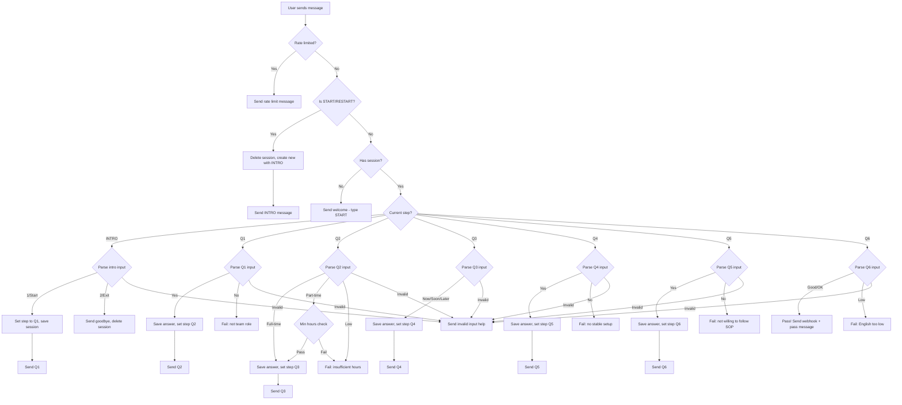

# SpanishVIP WhatsApp Screening Flow - Implementation Plan

## Overview

This plan details the changes needed to update the Twilio WhatsApp bot from English to Spanish, add a new Q6 (English level) question, and implement an INTRO step with proper START/RESTART behavior.

## Current State Analysis

### Existing Flow
- 5 questions (Q1-Q5) in English
- No INTRO step - users start directly at Q1
- Uses plain-text messages via Twilio REST API (already compliant with Fix A)
- Session management with KV store
- Rate limiting implemented
- START/RESTART resets to Q1

### What Needs to Change

1. **Add INTRO step** - New Step 0 before Q1
2. **Add Q6** - English level question after Q5
3. **Convert all messages to Spanish** with WhatsApp markdown and emojis
4. **Update input parsing** for Spanish keywords
5. **Update fail/pass messages** in Spanish
6. **Add invalid input help message**
7. **Update webhook payload** to include `english_level`

---

## Implementation Details

### 1. Type Updates

```typescript
// Update ScreeningStep to include INTRO and Q6
type ScreeningStep = "INTRO" | "Q1" | "Q2" | "Q3" | "Q4" | "Q5" | "Q6";

// Update Answers interface
interface Answers {
  team_role?: "yes" | "no";
  weekly_availability?: "full_time" | "part_time" | "low";
  start_date?: "now" | "soon" | "later";
  setup?: "yes" | "no";
  sop?: "yes" | "no";
  english_level?: "good" | "ok" | "low";  // NEW
}

// Update ResultPayload for webhook
interface ResultPayload {
  whatsapp_from: string;
  result: "pass" | "fail";
  reason: string;
  answers: {
    team_role: "yes" | "no" | undefined;
    weekly_availability: "full_time" | "part_time" | "low" | undefined;
    start_date: "now" | "soon" | "later" | undefined;
    setup: "yes" | "no" | undefined;
    sop: "yes" | "no" | undefined;
    english_level: "good" | "ok" | "low" | undefined;  // NEW
  };
  completed_at: string;
}
```

### 2. Message Constants

Create new message constants with Spanish copy, emojis, and WhatsApp markdown:

```typescript
const INTRO_TEXT = `👋 ¡Hola! Gracias por postularte para ser *Profesor/a de Español* en *SpanishVIP* 🇪🇸✨

🕒 Esto es un *pre-filtro rápido (2 minutos)* para confirmar algunos requisitos básicos.

✅ Para responder, escribe el *número* de la opción (por ejemplo: *1*) o la palabra clave indicada.

💡 _Tip:_ Responde con calma, un mensaje por pregunta 😊

¿List@? Responde:
1) Empezar 🚀
2) Salir ❌`;

const QUESTION_TEXT: Record<ScreeningStep, string> = {
  INTRO: INTRO_TEXT,
  Q1: `*Q1/6* 🧩
En SpanishVIP buscamos un rol de *equipo* (no estilo marketplace como italki/Preply).

¿Buscas un rol fijo y comprometido con el equipo?
1) ✅ Sí, quiero ser parte del equipo
2) ❌ No, solo freelance / marketplace`,
  Q2: `*Q2/6* 🗓️
¿Cuántas horas por semana puedes comprometerte de forma constante?
1) 💪 Tiempo completo (30+ hrs/sem)
2) 🙂 Medio tiempo (15–29 hrs/sem)
3) 🥲 Menos de 15 hrs/sem

También puedes escribir: FT / PT / LOW`,
  Q3: `*Q3/6* ⏱️
¿Cuándo podrías empezar?
1) 🚀 Inmediatamente
2) 📆 En 1–2 semanas
3) 🗓️ En 1 mes o más

También puedes escribir: NOW / 2WEEKS / 1MONTH`,
  Q4: `*Q4/6* 💻🎧
¿Tienes internet estable + un lugar tranquilo para enseñar?
1) ✅ Sí
2) ❌ No`,
  Q5: `*Q5/6* 📚✨
¿Estás de acuerdo en seguir el currículum y los SOPs del equipo?
1) ✅ Sí, claro
2) ❌ No`,
  Q6: `*Q6/6* 🇺🇸🗣️
Para coordinarnos mejor en el equipo, necesitamos un nivel mínimo de inglés.

¿Cuál es tu nivel de inglés?
1) ✅ Bueno (puedo conversar con confianza)
2) 🙂 Me defiendo (puedo comunicarme lo básico)
3) ❌ No sé mucho`,
};

// Fail messages
const FAIL_MESSAGES = {
  Q1: `💛 Gracias por tu sinceridad.
En este momento estamos buscando *miembros de equipo* con compromiso y disponibilidad constante.

🙏 Te deseamos lo mejor y gracias por postularte.`,
  Q2: `💛 ¡Gracias!
Por ahora necesitamos mínimo *15 horas/semana* de disponibilidad constante.

🙏 Te agradecemos tu tiempo y tu interés en SpanishVIP.`,
  Q4: `💛 Gracias por tu respuesta.
Para poder dar clases con calidad, necesitamos *internet estable* y un *espacio tranquilo*.

🙏 Te agradecemos tu tiempo.`,
  Q5: `💛 Gracias por tu sinceridad.
Para este rol es importante seguir nuestro sistema y procesos.

🙏 Te deseamos lo mejor y gracias por postularte.`,
  Q6: `💛 ¡Gracias!
Por ahora necesitamos al menos un nivel de inglés para comunicarnos en el equipo (aunque sea _"me defiendo"_).

🙏 Te agradecemos tu tiempo y tu interés en SpanishVIP.`,
};

// Pass message
const PASS_MESSAGE = `🎉 *¡Excelente! Has pasado el pre-filtro* ✅

🧑‍💼 Siguiente paso: hablar con una persona del equipo para coordinar tu *primera entrevista*.

👉 Escribe aquí a *Maria Camila* para continuar:
{MARIA_WA_ME_LINK}

💬 _Por favor envía este mensaje cuando le escribas:_
"Hola Maria, pasé el pre-filtro de SpanishVIP. Mi nombre es ___ y mi correo es ___."

💛 ¡Gracias y nos vemos pronto!`;

// Invalid input help message
const INVALID_INPUT_HELP = `😊 ¡Casi!
Por favor responde con el *número* de una opción (por ejemplo: *1*) o con la palabra clave.

✨ Si quieres reiniciar, escribe: *RESTART*
🚀 Para empezar desde cero, escribe: *START*`;
```

### 3. Input Parsing Updates

Update the input parsing to accept Spanish keywords:

```typescript
// INTRO step parsing
function parseIntroInput(input: string): "start" | "exit" | "invalid" {
  const upper = input.toUpperCase().trim();
  if (["1", "EMPEZAR", "START", "COMENZAR"].includes(upper)) return "start";
  if (["2", "SALIR", "EXIT", "QUIT"].includes(upper)) return "exit";
  return "invalid";
}

// Q1 parsing - team role
function parseQ1Input(input: string): "yes" | "no" | "invalid" {
  const upper = input.toUpperCase().trim();
  if (["1", "YES", "SI", "SÍ", "Y"].includes(upper)) return "yes";
  if (["2", "NO", "N"].includes(upper)) return "no";
  return "invalid";
}

// Q2 parsing - weekly availability
function parseQ2Input(input: string): "full_time" | "part_time" | "low" | "invalid" {
  const upper = input.toUpperCase().trim();
  if (["1", "FT", "FULLTIME", "FULL-TIME", "FULL"].includes(upper)) return "full_time";
  if (["2", "PT", "PARTTIME", "PART-TIME", "PART"].includes(upper)) return "part_time";
  if (["3", "LOW", "<15", "LESS", "MENOS"].includes(upper)) return "low";
  return "invalid";
}

// Q3 parsing - start date
function parseQ3Input(input: string): "now" | "soon" | "later" | "invalid" {
  const upper = input.toUpperCase().trim();
  if (["1", "NOW", "INMEDIATO", "INMEDIATAMENTE", "IMM"].includes(upper)) return "now";
  if (["2", "2WEEKS", "SOON", "PRONTO", "1-2", "1–2"].includes(upper)) return "soon";
  if (["3", "1MONTH", "LATER", "MAS", "MÁS", "1 MES"].includes(upper)) return "later";
  return "invalid";
}

// Q4 parsing - setup
function parseQ4Input(input: string): "yes" | "no" | "invalid" {
  const upper = input.toUpperCase().trim();
  if (["1", "YES", "SI", "SÍ"].includes(upper)) return "yes";
  if (["2", "NO"].includes(upper)) return "no";
  return "invalid";
}

// Q5 parsing - SOP
function parseQ5Input(input: string): "yes" | "no" | "invalid" {
  const upper = input.toUpperCase().trim();
  if (["1", "YES", "SI", "SÍ"].includes(upper)) return "yes";
  if (["2", "NO"].includes(upper)) return "no";
  return "invalid";
}

// Q6 parsing - English level
function parseQ6Input(input: string): "good" | "ok" | "low" | "invalid" {
  const upper = input.toUpperCase().trim();
  if (["1", "GOOD", "BUENO", "B1", "B2", "C1", "C2"].includes(upper)) return "good";
  if (["2", "DEFENDERME", "ME DEFIENDO", "BASIC", "BASICO", "BÁSICO"].includes(upper)) return "ok";
  if (["3", "POCO", "NO MUCHO", "NO SE", "NO", "NADA"].includes(upper)) return "low";
  return "invalid";
}
```

### 4. Flow Logic Updates



### 5. Session Creation Update

Update `createSession()` to start at INTRO:

```typescript
function createSession(): SessionState {
  const now = new Date().toISOString();
  return { step: "INTRO", answers: {}, startedAt: now, lastActivityAt: now };
}
```

### 6. START/RESTART Behavior Update

Update `processAndSend()` to send INTRO message instead of Q1:

```typescript
if (upper === "START" || upper === "RESTART") {
  console.log(`[processAndSend] from=${from} command=${upper} — resetting session`);
  await safeKvDelete(env.BOT_KV, `session:${from}`);
  const newSession = createSession(); // step: "INTRO"
  await saveSession(from, newSession, env);
  await sendTwilioText(from, QUESTION_TEXT["INTRO"], env);
  return;
}
```

### 7. Pass/Fail Session Updates

```typescript
async function passSession(from: string, session: SessionState, env: Env): Promise<void> {
  const payload: ResultPayload = {
    whatsapp_from: from,
    result: "pass",
    reason: "",
    answers: {
      team_role: session.answers.team_role,
      weekly_availability: session.answers.weekly_availability,
      start_date: session.answers.start_date,
      setup: session.answers.setup,
      sop: session.answers.sop,
      english_level: session.answers.english_level,
    },
    completed_at: new Date().toISOString(),
  };

  await Promise.all([
    safeKvDelete(env.BOT_KV, `session:${from}`),
    postResultWebhook(payload, env),
  ]);

  const link = env.MARIA_WA_ME_LINK ?? "Please await further instructions.";
  const message = PASS_MESSAGE.replace("{MARIA_WA_ME_LINK}", link);
  await sendTwilioText(from, message, env);
}

async function failSession(
  from: string,
  session: SessionState,
  reason: string,
  failMessage: string,
  env: Env
): Promise<void> {
  const payload: ResultPayload = {
    whatsapp_from: from,
    result: "fail",
    reason,
    answers: {
      team_role: session.answers.team_role,
      weekly_availability: session.answers.weekly_availability,
      start_date: session.answers.start_date,
      setup: session.answers.setup,
      sop: session.answers.sop,
      english_level: session.answers.english_level,
    },
    completed_at: new Date().toISOString(),
  };

  await Promise.all([
    safeKvDelete(env.BOT_KV, `session:${from}`),
    postResultWebhook(payload, env),
  ]);

  await sendTwilioText(from, failMessage, env);
}
```

### 8. handleStep Function Refactor

Refactor `handleStep()` to use the new parsing functions and handle all steps including INTRO and Q6:

```typescript
async function handleStep(
  session: SessionState,
  rawInput: string,
  from: string,
  env: Env
): Promise<void> {
  const input = rawInput.trim();
  
  switch (session.step) {
    case "INTRO": {
      const result = parseIntroInput(input);
      if (result === "start") {
        session.step = "Q1";
        await saveSession(from, session, env);
        await sendTwilioText(from, QUESTION_TEXT.Q1, env);
      } else if (result === "exit") {
        await safeKvDelete(env.BOT_KV, `session:${from}`);
        await sendTwilioText(from, "👋 ¡Gracias por tu interés! Si cambias de opinión, escribe *START* para comenzar.");
      } else {
        await sendTwilioText(from, INVALID_INPUT_HELP);
      }
      return;
    }
    
    case "Q1": {
      const result = parseQ1Input(input);
      if (result === "yes") {
        session.answers.team_role = "yes";
        session.step = "Q2";
        await saveSession(from, session, env);
        await sendTwilioText(from, QUESTION_TEXT.Q2, env);
      } else if (result === "no") {
        session.answers.team_role = "no";
        await failSession(from, session, "not_team_role", FAIL_MESSAGES.Q1, env);
      } else {
        await sendTwilioText(from, INVALID_INPUT_HELP);
      }
      return;
    }
    
    // ... similar for Q2-Q5 ...
    
    case "Q6": {
      const result = parseQ6Input(input);
      if (result === "good" || result === "ok") {
        session.answers.english_level = result;
        await passSession(from, session, env);
      } else if (result === "low") {
        session.answers.english_level = "low";
        await failSession(from, session, "english_low", FAIL_MESSAGES.Q6, env);
      } else {
        await sendTwilioText(from, INVALID_INPUT_HELP);
      }
      return;
    }
  }
}
```

---

## Files to Modify

### [`src/index.ts`](src/index.ts)

1. Update `ScreeningStep` type to include `"INTRO" | "Q6"`
2. Update `Answers` interface with new field names and `english_level`
3. Add `INTRO_TEXT` constant
4. Update `QUESTION_TEXT` with all Spanish messages
5. Add `FAIL_MESSAGES` constant
6. Add `PASS_MESSAGE` constant
7. Add `INVALID_INPUT_HELP` constant
8. Add parsing helper functions for each step
9. Update `createSession()` to start at INTRO
10. Update `passSession()` with new message and payload
11. Update `failSession()` to accept custom message
12. Refactor `handleStep()` to handle INTRO and Q6
13. Update `processAndSend()` START/RESTART to send INTRO
14. Remove any button-related parsing (keep ButtonPayload/ButtonText parsing but don't require it)

---

## Testing Checklist

- [ ] START command sends INTRO message
- [ ] RESTART command resets session and sends INTRO
- [ ] INTRO "1" proceeds to Q1
- [ ] INTRO "2" sends goodbye and deletes session
- [ ] Q1 "1"/"SI"/"SÍ"/"YES" passes to Q2
- [ ] Q1 "2"/"NO" fails with correct message
- [ ] Q2 "1"/"FT"/"FULLTIME" passes to Q3
- [ ] Q2 "2"/"PT"/"PARTTIME" passes to Q3 (if min_hours < 30)
- [ ] Q2 "3"/"LOW" fails with correct message
- [ ] Q3 all options pass to Q4
- [ ] Q4 "1"/"SI"/"YES" passes to Q5
- [ ] Q4 "2"/"NO" fails with correct message
- [ ] Q5 "1"/"SI"/"YES" passes to Q6
- [ ] Q5 "2"/"NO" fails with correct message
- [ ] Q6 "1"/"GOOD"/"BUENO" passes with webhook
- [ ] Q6 "2"/"DEFENDERME" passes with webhook
- [ ] Q6 "3"/"POCO" fails with correct message
- [ ] Invalid input shows help message
- [ ] Webhook payload includes all answer fields
- [ ] Rate limiting works correctly
- [ ] Session TTL is maintained

---

## Summary

This implementation will transform the bot from a 5-question English flow to a 6-question Spanish flow with:

1. **New INTRO step** - Welcomes users and explains the process
2. **New Q6** - English level screening
3. **Spanish messages** - All copy in Spanish with emojis and WhatsApp markdown
4. **Proper START/RESTART** - Always begins from INTRO
5. **Help messages** - Friendly invalid input responses
6. **Updated webhook** - Includes english_level field
